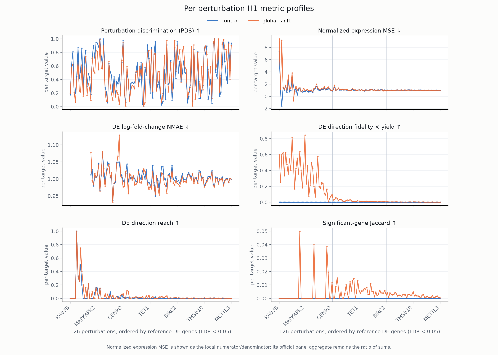

# VCC 2026 evaluation on H1

This is a lightweight development benchmark for testing zero-shot perturbation
models on Arc's public 2025 H1 training data with the 2026 VCC metric profile.
It is a deterministic resampling benchmark, not withheld truth or an official
Challenge score.

The benchmark covers the 126 H1 perturbations with at least 400 cells. It uses
one fixed 400-cell reference sample per perturbation and all 38,176 H1
non-targeting cells. Scoring is pinned to `cell-eval2==0.16.0`, source commit
`5e64833518a6603a0301cbe28185d49c30f4a986`, and the CPU `pdex==0.3.0` path.

## Quick start

Install the tagged GitHub release:

```bash
uv tool install git+https://github.com/forrestsheldon/vcc2026-h1-benchmark.git@v0.2.0
```

Prepare the benchmark once, then validate and score a prediction:

```bash
vcc-h1 setup
vcc-h1 validate prediction.h5ad
vcc-h1 score prediction.h5ad --output results/
```

Setup downloads the original 15.48 GB H1 training object directly from Arc,
verifies it, and extracts a 537 MB control-only H5AD locally. The repository
does not redistribute raw or derived single-cell count matrices. Pass an
existing source file to avoid the download:

```bash
vcc-h1 setup --h1 /path/to/adata_Training.h5ad
```

The default data location is printed by every command. Override it with
`--data-dir PATH`. Setup is resumable and idempotent. `--remove-source` removes
only an H1 file downloaded into the managed data directory, and only after all
artifacts pass validation; it never removes a file supplied with `--h1`.

Expect 14.5 GiB of network transfer, roughly 16 GiB of peak disk use, and
15–25 minutes for control extraction after the download on a modern laptop.
After `--remove-source`, the installed benchmark occupies about 575 MB.

## Prediction contract

`prediction.h5ad` must contain:

- raw, finite, non-negative integer counts in sparse `X`;
- exactly 50,400 cells: 400 for each canonical target;
- the exact 18,080-gene H1 axis in order;
- exactly one observation column, `target_gene`;
- no control cells;
- cell totals from 1 through 1,000,000.

The adapter supplies the real H1 controls internally. It reduces pseudobulks
one target at a time and performs prediction-side CPU DE in 512-gene chunks,
so it does not materialize a combined count matrix.

## Results

`score` writes four compact files:

- `scores.csv`: the six scaled metrics and `avg_score`;
- `aggregates.csv`: all ten VCC profile outputs;
- `per_target.csv`: target-level raw results where defined;
- `manifest.json`: prediction, benchmark, package, and output provenance.

The scaled metrics are perturbation discrimination (PDS), expression MSE, DE
log-fold-change accuracy, direction fidelity, direction reach, and significant
gene-set overlap. The other four outputs are expression diagnostics. Arc's
reference mean CPM `> 5` filter, normalization, target exclusion, aggregation,
edge cases, and capped MSE policy are retained.

A deterministic unchanged-control baseline can be run with:

```bash
vcc-h1 score-control-baseline --output control-baseline/
```

Its expected `avg_score` is approximately `-0.045230687652238`. This is distinct
from the generic-response baseline that defines zero on the score scale.

Compare per-perturbation metric profiles from one or more completed scores with:

```bash
vcc-h1 plot control=control-baseline/ model=results/ \
  --targets TMSB4X PRCP HIRA \
  --output perturbation-profiles.png
```

Omit `--targets` to show the complete panel. Perturbations are ordered by their
number of significant genes in the frozen 400-cell reference DE table. The six
scored metrics are drawn as aligned curves, and a companion CSV records each raw
per-target value and its contribution to the corresponding aggregate. Plotting
uses only compact score and reference artifacts; it does not load H1 counts or
repeat DE.



*Example: unchanged controls versus controls plus the global H1 perturbation
shift, with all 126 perturbations ordered by reference DE-gene count.*

## Relationship to the Challenge

Use the official [`vcc-cli`](https://pypi.org/project/vcc-cli/) 0.2.0 or newer
to validate, package, and submit Challenge predictions. This project is an H1
development tool and does not access validation truth or reproduce leaderboard
scores. Its metric implementation is delegated to Arc's
[`cell-eval2`](https://github.com/ArcInstitute/cell-eval2).

See [DATA_PROVENANCE.md](DATA_PROVENANCE.md) for exact inputs, fingerprints,
and the contents of the derived benchmark bundle.

## Development

```bash
uv sync --extra test
uv run ruff check .
uv run pytest
```

Scale reconstruction is maintainer-only and lives under `tools/`; ordinary
setup never repeats the generic-baseline or split-half anchor computations.
